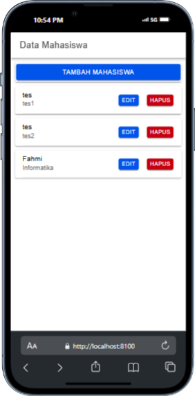
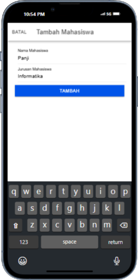
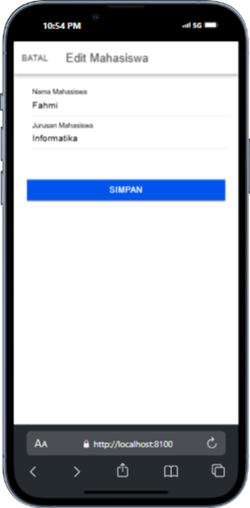
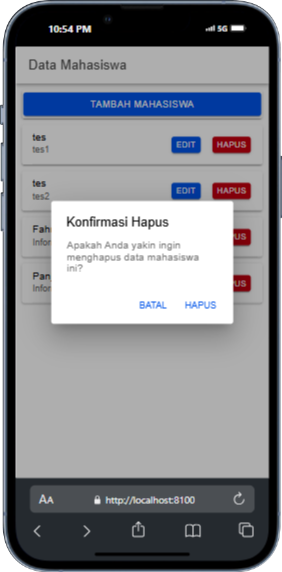

# TugasMobile8_AbdulAziz_ShiftE
 
# CRUD Mahasiswa

## Screenshots dan Penjelasan

### 1. Melihat Data Mahasiswa (Read)

|  |
|-----------------------------------|
| Pada halaman utama aplikasi, semua data mahasiswa ditampilkan menggunakan `ion-card`. Data diperoleh dari API PHP (`tampil.php`) yang mengirimkan semua data dari tabel `mahasiswa`. Setiap mahasiswa ditampilkan dalam kartu yang berisi nama dan jurusan, serta dilengkapi tiga tombol aksi:  |
| - **Edit**: Tombol ini membuka modal untuk mengedit data mahasiswa. Tombol ini mengarahkan ke proses update (edit) data. |
| - **Hapus**: Tombol ini akan memunculkan dialog konfirmasi untuk menghapus data mahasiswa. Jika dikonfirmasi, data mahasiswa akan dihapus dari database. |
| - **Tambah Mahasiswa**: Tombol ini terletak di bagian bawah halaman, memungkinkan pengguna untuk menambahkan mahasiswa baru ke dalam database. |

### 2. Menambah Data Mahasiswa (Create)

|  | 
|---------------------------------------|
| Modal untuk menambahkan data mahasiswa baru. Pengguna dapat mengisi `Nama Mahasiswa` dan `Jurusan`, lalu menekan tombol `Tambah Mahasiswa`. Data ini dikirim ke API PHP (`tambah.php`) untuk disimpan di database. Setelah berhasil, data mahasiswa baru akan muncul di daftar. |

### 3. Mengedit Data Mahasiswa (Update)

|  | 
|-------------------------------------|
| Modal `Edit Mahasiswa`, di mana pengguna dapat memperbarui informasi mahasiswa yang dipilih. Setelah perubahan dilakukan, data dikirim ke API PHP (`edit.php`) yang memperbarui database sesuai dengan `id` mahasiswa. Daftar akan menampilkan data terbaru setelah pengeditan berhasil. |

### 4. Menghapus Data Mahasiswa (Delete)

|  | 
|-------------------------------------------------|
| Pada daftar mahasiswa, pengguna dapat menekan tombol Hapus di samping data mahasiswa yang diinginkan. Sistem akan menampilkan konfirmasi penghapusan untuk memastikan pengguna yakin ingin menghapus data tersebut. Jika dikonfirmasi, data mahasiswa akan dihapus menggunakan API PHP (`hapus.php`) berdasarkan `id`. |